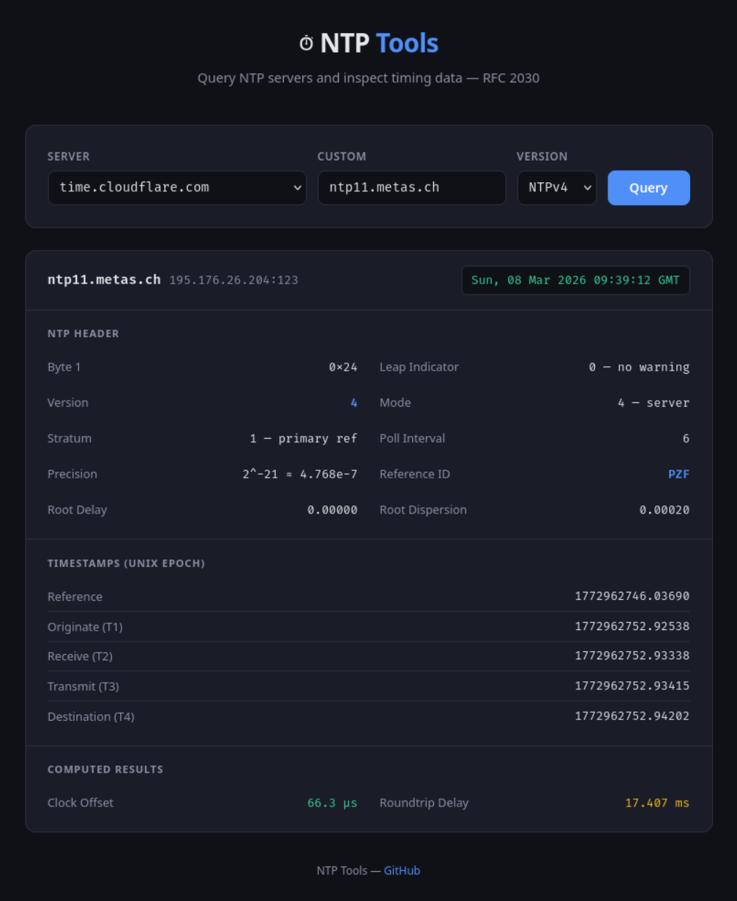

# NTP Tools

[](https://github.com/jpmieville/ntpTools/actions/workflows/ci.yml)

SNTP (Simple Network Time Protocol) client tools for retrieving time from NTP servers.

## Overview

This project provides NTP client implementations in both Python and Go, based on RFC 2030. It can query NTP servers to get the current time and display detailed timing information.

## Features

- Query NTP servers and retrieve accurate time
- Display detailed NTP packet information (stratum, precision, root delay, etc.)
- Calculate clock offset and roundtrip delay
- Support for NTP versions 3 and 4
- Configurable timeout
- Verbose debug output (Go CLI)
- **Web interface** — browser-based NTP client with a single-binary server (`go:embed`)

## Requirements

### Python Version

- Python 3.x

### Go Version

- Go 1.16 or later

## Usage

### Python

```bash
# Use default server
python src/ntpClient.py

# Use specific NTP server
python src/ntpClient.py time.google.com

# Use NTP version 3
python src/ntpClient.py -v 3 0.pool.ntp.org

# List available servers
python src/ntpClient.py -l

# Output as JSON
python src/ntpClient.py --json time.google.com

# Compact single-line JSON (for piping)
python src/ntpClient.py --compact time.google.com
```

### Go

```bash
# Use default server
go run ./cmd/ntpclient

# Use specific NTP server
go run ./cmd/ntpclient -server time.google.com

# Use NTP version 3
go run ./cmd/ntpclient -version 3 0.pool.ntp.org

# Custom timeout
go run ./cmd/ntpclient -timeout 10s ntp.metas.ch

# Verbose debug output
go run ./cmd/ntpclient -verbose -server ch01dc201

# Output as JSON
go run ./cmd/ntpclient -json -server time.google.com

# Compact single-line JSON (for piping)
go run ./cmd/ntpclient -compact -server time.google.com

# List available servers
go run ./cmd/ntpclient -list-servers
```

### Web Server

```bash
# Start the web server (default :8080)
go run ./cmd/ntpweb

# Custom listen address
go run ./cmd/ntpweb -addr :3000

# Build a single self-contained binary
go build -o ntpweb ./cmd/ntpweb
./ntpweb
```

Then open [http://localhost:8080](http://localhost:8080) in your browser.

The web server provides:

- `GET /` — serves the embedded web UI
- `GET /api/ntp?server=time.google.com&version=4` — returns NTP result as JSON
- `GET /api/servers` — returns the list of default NTP servers



## Command-Line Options

### Python

| Option | Description | Default |
|--------|-------------|---------|
| `server` | NTP server hostname or IP | 129.132.2.21 |
| `-v, --version` | NTP version (3 or 4) | 4 |
| `-t, --timeout` | Socket timeout in seconds | 20.0 |
| `-l, --list-servers` | List available default servers | - |
| `--json` | Output result as JSON | - |
| `--compact` | Compact single-line JSON (implies --json) | - |

### Go

| Option | Description | Default |
|--------|-------------|---------|
| `-server` | NTP server hostname or IP | 129.132.2.21 |
| `-version` | NTP version (3 or 4) | 4 |
| `-timeout` | Socket timeout | 20s |
| `-list-servers` | List available default servers | - |
| `-json` | Output result as JSON | - |
| `-compact` | Compact single-line JSON (implies -json) | - |
| `-verbose` | Enable verbose debug output | - |

## Default NTP Servers

- `129.132.2.21` (swisstime.ethz.ch)
- `0.pool.ntp.org`
- `time.google.com`
- `time.cloudflare.com`

## Output Example

```
Response received from : time.google.com
IP address             : 216.239.35.8:123

Header
--------------------------------------------------
Byte1                  : 0x24
  Leap Indicator (LI)  : 0 [no warning]
  Version number (VN)  : 4 [NTP/SNTP version number]
  Mode                 : 4 [server]
Stratum                : 1 [primary reference (e.g. radio clock)]
Poll interval          : 5
Clock Precision        : 2**-18 = 3.81470e-06
Root Delay             : 0x00000000 =    0.00000
Root Dispersion        : 0x00000000 =    0.00000
Reference Identifier   : GOOG

Interpreted results (Unix epoch):
--------------------------------------------------
Reference Timestamp    : 1772717317.76883
Originate Timestamp    : 1772717804.80153
Receive   Timestamp    : 1772717804.90983
Transmit  Timestamp    : 1772717804.90984
Destination Timestamp  : 1772717804.80153
--------------------------------------------------

Net Time UTC           : Thu, 05 Mar 2026 13:36:44 UTC + 909.830 ms
Clock Offset           :    0.10830 seconds
Roundtrip Delay        :    0.00001 seconds
```

## Testing

Both implementations include unit tests covering packet parsing, time conversion, and clock offset/roundtrip delay calculations.

### Python

```bash
python3 -m unittest src.test_ntpClient -v
```

### Go

```bash
go test -v ./pkg/ntp/
```

## Building

### Go CLI

```bash
# Build for current platform
go build -o ntpclient ./cmd/ntpclient

# Build for Windows
GOOS=windows GOARCH=amd64 go build -o ntpclient.exe ./cmd/ntpclient
```

### Go Web Server

```bash
# Build self-contained binary (static files embedded)
go build -o ntpweb ./cmd/ntpweb
```

## License

This project is licensed under the [MIT License](LICENSE).
